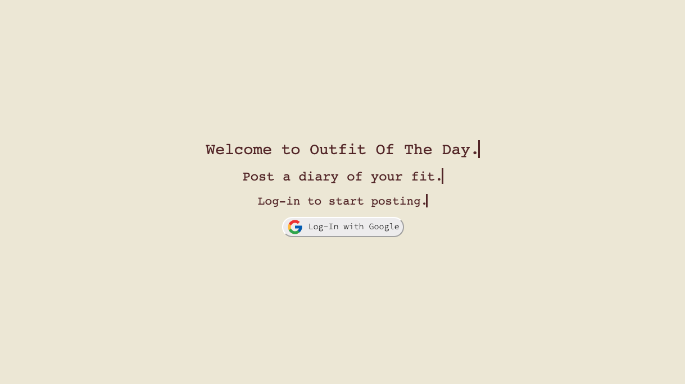
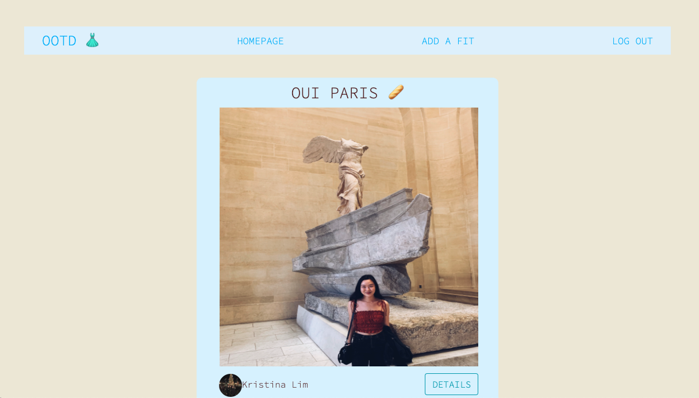
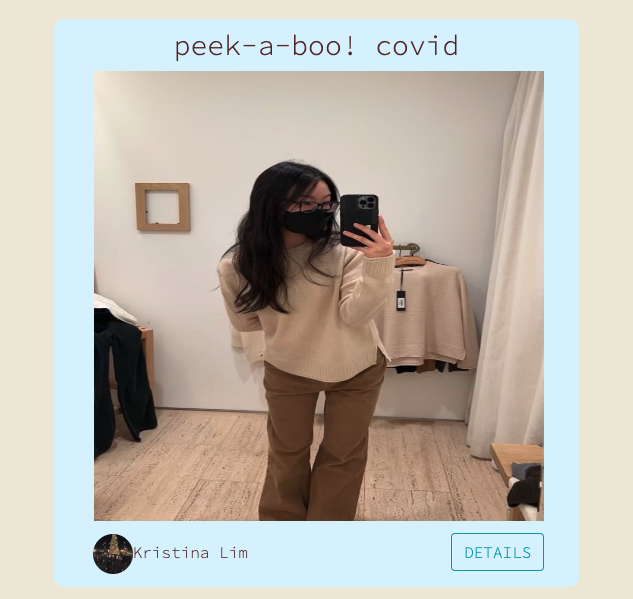
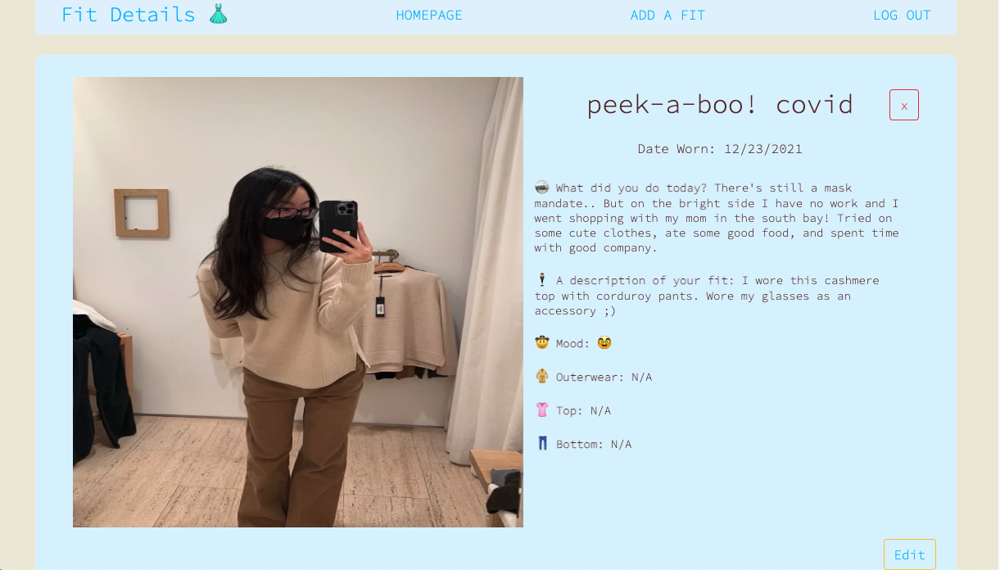
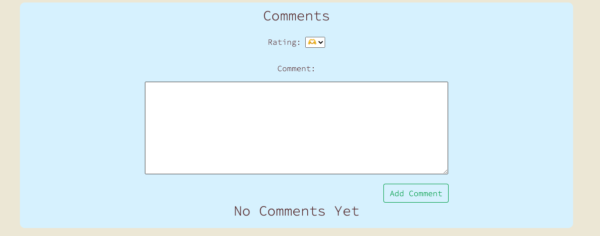
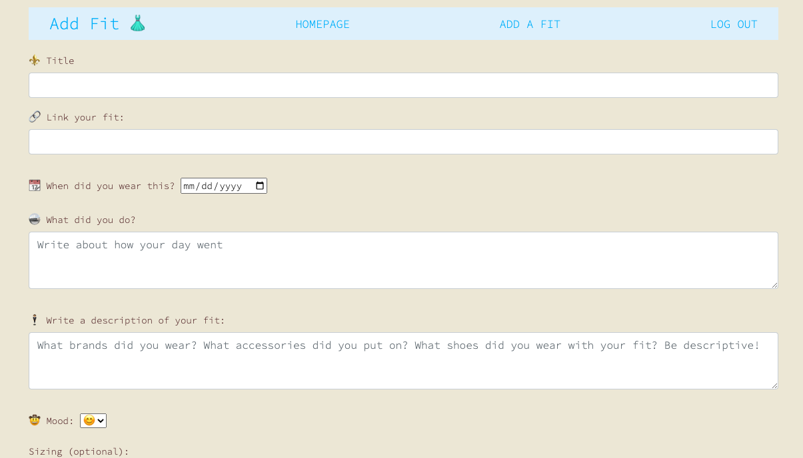

  # :dress: OOTD :dress:

  ### [Add Your Fits](http://ootd-fit-of-the-day.herokuapp.com/)

  ##### Created by Kristina Lim

  

  ## :pencil: Description

  OOTD is a good way to keep track of what the user has worn throughout the week. A user can add a post, add a link to the photo, write what they did on that day and describe their outfit and paste a link of their clothing item. The user can also look at other users' post by going to the homepage in order to get some outfit ideas. In case there are spelling errors, or the user wants to add more information, they can edit their entry. If they want to remove it completely, they can remove it. 

  

   ## :camera_flash: Screenshots 
<h3 align="center">Welcome Page</h3>
  
<h3 align="center">Homepage</h3>
  
<h3 align="center">Post</h3>
  
<h3 align="center">Show Page</h3>
  
<h3 align="center">Comment Section</h3>
  
<h3 align="center">Add Fit</h3>

## :computer: Technologies Used

 

## :spiral_notepad: Getting Started

 #### [Project planning and wireframing](https://trello.com/b/NHF7R4Js/project-2/)
  

## :ice_cube: Icebox Features :ice_cube:
* Add a like button with a page full of liked photos.
* Enable my posts page in order for the user to view all their own posts.
* Add image upload feature so that the user doesn't have to go to Imgur to link their photo.

